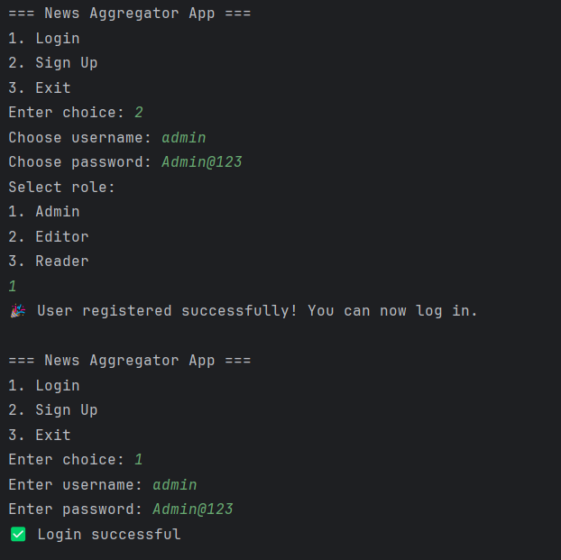
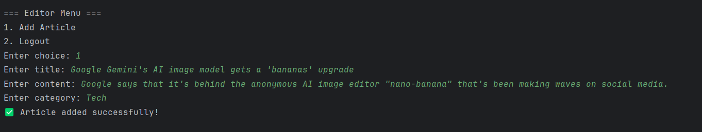
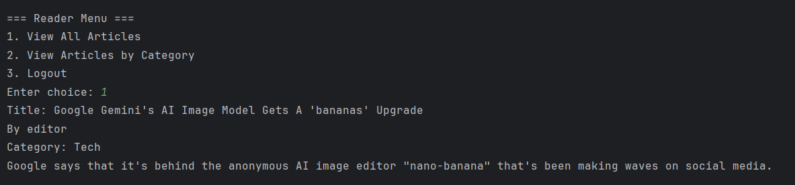
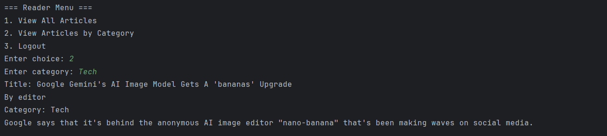
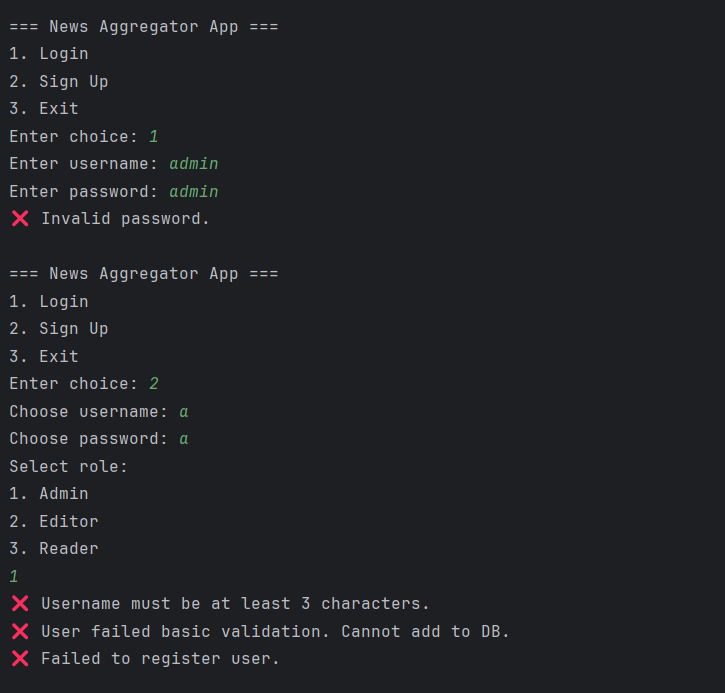

# Personalized News Aggregator

## 📌 Project Overview

The **Personalized News Aggregator** is a Java-based application that allows users to register, authenticate, and access curated news articles.
It follows a modular design with DAO (Data Access Object), service layers, and database connectivity for storing and retrieving user/article information.

---

## ⚙️ Features

* 👤 **User Management**

  * Register new users with validation
  * Authenticate existing users with secure login
  
    
* 📰 **Article Management**

  * Store and retrieve articles
  * Support for personalized news aggregation
  
  
  

* 🔒 **Validation**

  * Basic username and password validation using regex
  * Duplicate user checks
    
    
* 💾 **Database Integration**

  * Configurable JDBC connection (`db.properties`)
  * DAO pattern for clean separation of logic
* 🚀 **Maven Project**

  * Built and managed with **Maven**
  * Dependencies and build lifecycle handled by `pom.xml`

---

## 📂 Project Structure

```
PersonalizedNewsAggregator/
│── pom.xml
│── db.properties
│── src/
│   ├── module-info.java
│   ├── com/news/app/App.java
│   ├── com/news/dao/
│   │   ├── ArticleDAO.java
│   │   ├── ArticleDAOImpl.java
│   │   ├── UserDAO.java
│   │   ├── UserDAOImpl.java
│   ├── com/news/model/
│   │   ├── Article.java
│   │   ├── User.java
│   ├── com/news/service/
│       ├── AuthService.java
│       ├── DBConnection.java
```

---

## 🛠️ Tech Stack

* **Language**: Java
* **Build Tool**: Maven
* **Database**: JDBC (configured via `db.properties`)
* **Design Pattern**: DAO (Data Access Object)

---

## 🔧 Setup & Installation

1. Clone this repository:

   ```bash
   git clone https://github.com/your-repo/PersonalizedNewsAggregator.git
   ```
2. Navigate into the project:

   ```bash
   cd PersonalizedNewsAggregator
   ```
3. Configure your database in `db.properties`:

   ```properties
   db.url=jdbc:mysql://localhost:3306/newsdb
   db.username=your_username
   db.password=your_password
   ```
4. Build the project with Maven:

   ```bash
   mvn clean install
   ```
5. Run the application:

   ```bash
   java -cp target/PersonalizedNewsAggregator-0.0.1-SNAPSHOT.jar com.news.app.App
   ```

---

## 🚀 Usage

* **Register a User** → Enter username & password (validated with regex).
* **Login** → Authenticate user credentials against DB.
* **View Articles** → Retrieve and display stored articles.

---

## 📖 Future Enhancements

* 🔗 Integration with live news APIs (e.g., NewsAPI.org)
* ⭐ Personalized recommendation engine
* 🌐 Web interface using Spring Boot / React

---
